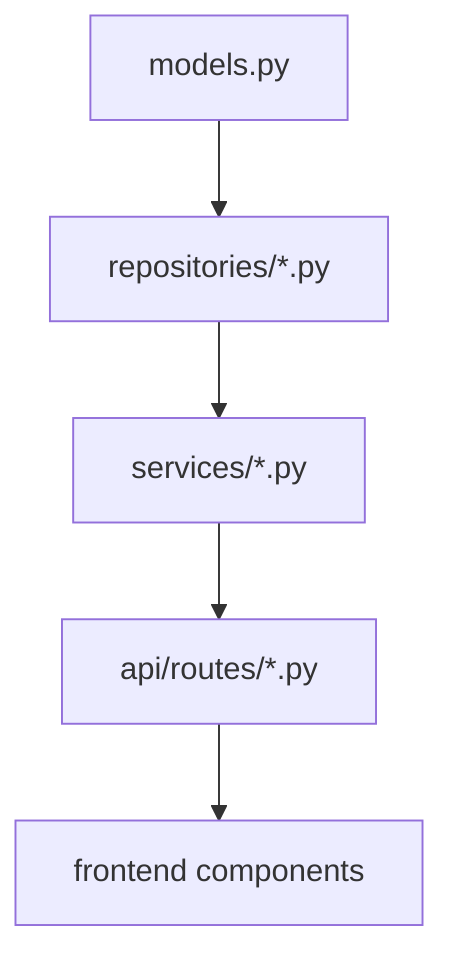
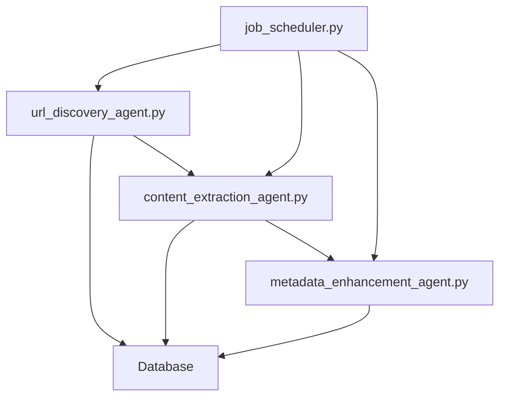

# Naija News Hub - File Relationship Rules

## Executive Summary

This document defines the critical relationships between project files and establishes rules for maintaining integrity when files are updated. Following these rules will ensure consistency across documentation and code, reduce bugs, and improve developer productivity.

**Key Points:**

- **Critical Relationships**: Database schema → Models → Repositories → Services → API
- **Most Important Rules**: Update database documentation first, then code, then tests
- **Common Pitfalls**: Forgetting to update tests, documentation lag, inconsistent API responses
- **Automation Opportunities**: Pre-commit hooks, documentation linting, schema validation

This guide serves as both a reference and a checklist when making changes to the codebase. New developers should focus on understanding the database schema, scraper components, and API relationships first.

## Directory Structure Overview

```
naija-news-hub/
├── src/                  # Source code
│   ├── web_scraper/      # Web scraping components
│   │   ├── url_discovery_agent.py
│   │   ├── content_extraction_agent.py
│   │   └── metadata_enhancement_agent.py
│   ├── database_management/ # Database components
│   │   ├── models.py
│   │   └── repositories/
│   ├── services/         # Business logic
│   ├── scheduler/        # Job scheduling
│   └── utils/            # Utility functions
├── api/                  # API endpoints
│   ├── routes/
│   └── schemas/
├── frontend/             # Next.js frontend
│   ├── src/
│   │   ├── app/
│   │   └── components/
├── config/               # Configuration
├── docs/                 # Documentation
│   ├── api/              # API documentation
│   ├── dev/              # Developer documentation
│   ├── pm/               # Project management
│   ├── app/              # Application documentation
│   ├── frontend/         # Frontend documentation
│   └── notes/            # Project notes
├── tests/                # Test files
└── migrations/           # Database migrations
```

## Key File Relationships

### 1. Database Schema → Repositories → Services → API

The data flow typically follows this pattern:

1. **Database Schema** (`src/database_management/models.py`): Defines the data models and relationships
2. **Repositories** (`src/database_management/repositories/`): Provides methods to interact with the database
3. **Services** (`src/services/`): Implements business logic using repositories
4. **API Routes** (`api/routes/`): Exposes functionality through HTTP endpoints



### 2. Scraper Workflow

The scraping system connects these components:

1. **URL Discovery Agent** (`src/web_scraper/url_discovery_agent.py`): Finds new URLs to scrape
2. **Content Extraction Agent** (`src/web_scraper/content_extraction_agent.py`): Extracts content from URLs
3. **Metadata Enhancement Agent** (`src/web_scraper/metadata_enhancement_agent.py`): Enriches content with metadata
4. **Job Scheduler** (`src/scheduler/job_scheduler.py`): Coordinates scraping jobs



## Core Documentation Relationships

### Database Documentation

| Primary File                       | Related Files                            | Integrity Rule                                                                                                        | Priority |
| ---------------------------------- | ---------------------------------------- | --------------------------------------------------------------------------------------------------------------------- | -------- |
| `docs/dev/database-schema.md`      | `docs/pm/tdd.md`                         | When database schema is updated, ensure the schema section in TDD is updated to match.                                | HIGH     |
| `docs/dev/database-schema.md`      | `config/config_template.py`              | When database schema is updated, ensure Pydantic models in config template reflect the changes.                       | HIGH     |
| `docs/dev/database-schema.md`      | `docs/dev/development-tasks.md`          | When database schema is updated, ensure database-related tasks are updated accordingly.                               | MEDIUM   |
| `docs/dev/database-schema.md`      | `docs/dev/testing-checklist.md`          | When database schema is updated, ensure database testing sections are updated to cover new/changed features.          | HIGH     |
| `docs/dev/database-schema.md`      | `docs/dev/enhanced-testing-checklist.md` | When database schema is updated, ensure enhanced database testing sections are updated to cover new/changed features. | MEDIUM   |
| `docs/dev/database-integration.md` | `src/database/repositories/*.py`         | When repository implementations are updated, ensure database integration documentation is updated to match.           | HIGH     |
| `docs/dev/database-integration.md` | `src/services/article_service.py`        | When article service is updated, ensure database integration documentation is updated to match.                       | HIGH     |
| `docs/dev/database-integration.md` | `docs/dev/development-tasks.md`          | When database integration documentation is updated, ensure development tasks are updated accordingly.                 | MEDIUM   |
| `docs/dev/database-integration.md` | `docs/pm/project-journey.md`             | When database integration is updated, ensure project journey document reflects the changes.                           | LOW      |

### Testing Documentation

| Primary File                             | Related Files                            | Integrity Rule                                                                                           | Priority |
| ---------------------------------------- | ---------------------------------------- | -------------------------------------------------------------------------------------------------------- | -------- |
| `docs/dev/testing-checklist.md`          | `docs/dev/enhanced-testing-checklist.md` | When testing checklist is updated, ensure enhanced testing checklist is updated to maintain consistency. | HIGH     |
| `docs/dev/testing-checklist.md`          | `docs/dev/development-tasks.md`          | When testing checklist is updated, ensure testing tasks in development tasks are updated accordingly.    | MEDIUM   |
| `docs/dev/enhanced-testing-checklist.md` | `docs/dev/testing-checklist.md`          | When enhanced testing checklist is updated, ensure regular testing checklist is updated with core items. | HIGH     |

### Development Tasks

| Primary File                    | Related Files                   | Integrity Rule                                                                                                | Priority |
| ------------------------------- | ------------------------------- | ------------------------------------------------------------------------------------------------------------- | -------- |
| `docs/dev/development-tasks.md` | `docs/pm/tdd.md`                | When development tasks are updated, ensure TDD reflects any architectural or design changes.                  | MEDIUM   |
| `docs/dev/development-tasks.md` | `docs/dev/testing-checklist.md` | When development tasks are updated, ensure testing checklist covers the new/changed features.                 | HIGH     |
| `docs/dev/development-tasks.md` | `README.md`                     | When major development tasks are completed, ensure README is updated to reflect current project status.       | MEDIUM   |
| `docs/dev/development-tasks.md` | `docs/pm/project-journey.md`    | When significant development tasks are completed, add an entry to the project journey document with the date. | LOW      |

### Configuration Files

| Primary File                | Related Files                      | Integrity Rule                                                                                                            | Priority |
| --------------------------- | ---------------------------------- | ------------------------------------------------------------------------------------------------------------------------- | -------- |
| `config/config_template.py` | `.env.example`                     | When configuration template is updated, ensure .env.example includes all required environment variables.                  | HIGH     |
| `config/config_template.py` | `.env`                             | When configuration template is updated, ensure your local .env file is updated with new variables (not committed to Git). | HIGH     |
| `.env.example`              | `docs/dev/database-schema.md`      | When database-related environment variables are updated, ensure they align with the database schema documentation.        | MEDIUM   |
| `config/config_template.py` | `docs/dev/crawl4ai-integration.md` | When Crawl4AI configuration is updated, ensure the integration documentation is updated to match.                         | HIGH     |
| `config/config.py`          | `docs/dev/crawl4ai-integration.md` | When Crawl4AI configuration implementation is updated, ensure the integration documentation is updated to match.          | HIGH     |

### MCP Configuration

| Primary File        | Related Files                     | Integrity Rule                                                                                     | Priority |
| ------------------- | --------------------------------- | -------------------------------------------------------------------------------------------------- | -------- |
| `mcp.json`          | `utils/mcp/time.py`               | When MCP time configuration is updated, ensure the time utility implementation is compatible.      | MEDIUM   |
| `utils/mcp/time.py` | `docs/pm/project-journey.md`      | When MCP time module is updated, ensure project journey document uses the correct date format.     | MEDIUM   |
| `utils/mcp/time.py` | Any documentation with timestamps | When MCP time module is updated, ensure all documentation with timestamps follows the same format. | LOW      |

## Code Relationships

### Database Models

| Primary File                                                 | Related Files                                 | Integrity Rule                                                                                        |
| ------------------------------------------------------------ | --------------------------------------------- | ----------------------------------------------------------------------------------------------------- |
| `models/database.py`                                         | `docs/dev/database-schema.md`                 | When database models are updated, ensure database schema documentation is updated to match.           |
| `models/database.py`                                         | `migrations/`                                 | When database models are updated, ensure a new migration is created to update the database schema.    |
| `models/database.py`                                         | `repositories/`                               | When database models are updated, ensure repository classes are updated to handle the changes.        |
| `src/database_management/models.py`                          | `src/web_scraper/url_discovery_agent.py`      | When sitemaps table is updated, ensure URL Discovery Agent is updated to handle the changes.          |
| `src/database_management/models.py`                          | `src/web_scraper/content_extraction_agent.py` | When sitemaps table is updated, ensure Content Extraction Agent is updated to handle the changes.     |
| `src/database_management/repositories/sitemap_repository.py` | `src/web_scraper/url_discovery_agent.py`      | When sitemap repository is updated, ensure URL Discovery Agent is updated to handle the changes.      |
| `src/database_management/repositories/sitemap_repository.py` | `src/web_scraper/content_extraction_agent.py` | When sitemap repository is updated, ensure Content Extraction Agent is updated to handle the changes. |

### Scraper Components

| Primary File                                    | Related Files                                 | Integrity Rule                                                                                                   |
| ----------------------------------------------- | --------------------------------------------- | ---------------------------------------------------------------------------------------------------------------- |
| `src/web_scraper/url_discovery_agent.py`        | `docs/dev/crawl4ai-integration.md`            | When URL Discovery Agent code is updated, ensure Crawl4AI integration documentation is updated.                  |
| `src/web_scraper/content_extraction_agent.py`   | `docs/dev/crawl4ai-integration.md`            | When Content Extraction Agent code is updated, ensure Crawl4AI integration documentation is updated.             |
| `src/web_scraper/metadata_enhancement_agent.py` | `docs/dev/crawl4ai-integration.md`            | When Metadata Enhancement Agent code is updated, ensure Crawl4AI integration documentation is updated.           |
| `src/web_scraper/url_discovery_agent.py`        | `docs/dev/scraping-workflow-architecture.mdc` | When URL Discovery Agent code is updated, ensure scraping workflow architecture documentation is updated.        |
| `src/web_scraper/content_extraction_agent.py`   | `docs/dev/scraping-workflow-architecture.mdc` | When Content Extraction Agent code is updated, ensure scraping workflow architecture documentation is updated.   |
| `src/web_scraper/metadata_enhancement_agent.py` | `docs/dev/scraping-workflow-architecture.mdc` | When Metadata Enhancement Agent code is updated, ensure scraping workflow architecture documentation is updated. |
| `src/web_scraper/url_discovery_agent.py`        | `src/database_management/models.py`           | When URL Discovery Agent code is updated, ensure database models (especially sitemaps table) are compatible.     |
| `src/web_scraper/content_extraction_agent.py`   | `src/database_management/models.py`           | When Content Extraction Agent code is updated, ensure database models are compatible.                            |
| `src/web_scraper/url_discovery_agent.py`        | `tests/test_scraper.py`                       | When URL Discovery Agent code is updated, ensure tests are updated to cover the changes.                         |
| `src/web_scraper/content_extraction_agent.py`   | `tests/test_scraper.py`                       | When Content Extraction Agent code is updated, ensure tests are updated to cover the changes.                    |
| `src/web_scraper/metadata_enhancement_agent.py` | `tests/test_scraper.py`                       | When Metadata Enhancement Agent code is updated, ensure tests are updated to cover the changes.                  |
| `src/web_scraper/url_discovery_agent.py`        | `docs/dev/testing-checklist.md`               | When URL Discovery Agent features are added/changed, ensure testing checklist is updated.                        |
| `src/web_scraper/content_extraction_agent.py`   | `docs/dev/testing-checklist.md`               | When Content Extraction Agent features are added/changed, ensure testing checklist is updated.                   |
| `src/web_scraper/metadata_enhancement_agent.py` | `docs/dev/testing-checklist.md`               | When Metadata Enhancement Agent features are added/changed, ensure testing checklist is updated.                 |
| `src/web_scraper/url_discovery_agent.py`        | `docs/dev/efficient-scraping-architecture.md` | When URL Discovery Agent code is updated, ensure it follows the efficient scraping principles.                   |
| `src/web_scraper/content_extraction_agent.py`   | `docs/dev/efficient-scraping-architecture.md` | When Content Extraction Agent code is updated, ensure it follows the efficient scraping principles.              |
| `src/web_scraper/metadata_enhancement_agent.py` | `docs/dev/efficient-scraping-architecture.md` | When Metadata Enhancement Agent code is updated, ensure it follows the efficient scraping principles.            |
| `src/scheduler/job_scheduler.py`                | `docs/dev/efficient-scraping-architecture.md` | When job scheduler is updated, ensure it follows the batch processing principles.                                |
| `src/utils/compression.py`                      | `docs/dev/efficient-scraping-architecture.md` | When compression utilities are updated, ensure they align with the content compression strategy.                 |
| `src/services/archive_service.py`               | `docs/dev/efficient-scraping-architecture.md` | When archive service is updated, ensure it follows the data retention policies.                                  |

### API Components

| Primary File                                   | Related Files                        | Integrity Rule                                                                                           |
| ---------------------------------------------- | ------------------------------------ | -------------------------------------------------------------------------------------------------------- |
| `api/routes/`                                  | `docs/api/api-documentation.md`      | When API routes are updated, ensure API documentation is updated to match.                               |
| `api/routes/`                                  | `tests/test_api.py`                  | When API routes are updated, ensure API tests are updated to cover the changes.                          |
| `api/schemas/`                                 | `models/database.py`                 | When API schemas are updated, ensure they remain compatible with database models.                        |
| `frontend/src/app/dashboard/websites/page.tsx` | `docs/app/user-guide.md`             | When websites management page is updated, ensure user guide is updated to match.                         |
| `frontend/src/app/dashboard/jobs/page.tsx`     | `docs/app/user-guide.md`             | When jobs management page is updated, ensure user guide is updated to match.                             |
| `frontend/src/components/layout/Header.tsx`    | `docs/frontend/project-structure.md` | When header component is updated, ensure frontend project structure documentation is updated if needed.  |
| `frontend/src/components/layout/Footer.tsx`    | `docs/frontend/project-structure.md` | When footer component is updated, ensure frontend project structure documentation is updated if needed.  |
| `frontend/src/components/layout/Sidebar.tsx`   | `docs/frontend/project-structure.md` | When sidebar component is updated, ensure frontend project structure documentation is updated if needed. |

### Project Journey

| Primary File                 | Related Files                   | Integrity Rule                                                                                                    |
| ---------------------------- | ------------------------------- | ----------------------------------------------------------------------------------------------------------------- |
| `docs/pm/project-journey.md` | `docs/dev/development-tasks.md` | When the project journey is updated, ensure it reflects completed development tasks.                              |
| `docs/pm/project-journey.md` | `docs/pm/tdd.md`                | When architectural decisions are documented in the project journey, ensure they are reflected in the TDD.         |
| `docs/pm/project-journey.md` | `README.md`                     | When major milestones are documented in the project journey, update the README to reflect current project status. |

### Time Handling

| Primary File        | Related Files                | Integrity Rule                                                                                       |
| ------------------- | ---------------------------- | ---------------------------------------------------------------------------------------------------- |
| `utils/mcp/time.py` | All documentation files      | When updating documentation with dates or timestamps, use the MCP time module to ensure consistency. |
| `utils/mcp/time.py` | `docs/pm/project-journey.md` | When adding entries to the project journey, include the current date from the MCP time module.       |
| `utils/mcp/time.py` | Database timestamp fields    | When storing timestamps in the database, use consistent formats from the MCP time module.            |

## Documentation Consistency Rules

1. **Version Numbers**: When updating version numbers, ensure they are updated in:

   - `README.md`
   - `setup.py`
   - `scraper/__init__.py`
   - `docs/pm/changelog.md`

2. **Feature Descriptions**: When adding/changing features, ensure they are consistently described in:

   - `README.md`
   - `docs/pm/tdd.md`
   - `docs/dev/development-tasks.md`
   - Relevant API documentation

3. **Database Schema Changes**: When making database schema changes:

   - Update `docs/dev/database-schema.md` first
   - Create database migration scripts
   - Update Pydantic models in `config/config_template.py`
   - Update ORM models in `src/database/models.py`
   - Update repository classes in `src/database/repositories/`
   - Update tests to cover the changes
   - Update `docs/dev/database-integration.md` to reflect the changes

4. **Testing Documentation**: When updating testing documentation:

   - Ensure both `testing-checklist.md` and `enhanced-testing-checklist.md` remain in sync
   - Update actual test files to implement the described tests
   - Update development tasks to reflect testing requirements

5. **Crawl4AI Integration**: When updating Crawl4AI integration:

   - Update `docs/dev/crawl4ai-integration.md` to reflect implementation changes
   - Update `docs/dev/scraping-workflow-architecture.mdc` to reflect workflow changes
   - Update agent implementation files to maintain consistency
   - Update configuration in `config/config_template.py` if needed
   - Update tests to cover the changes
   - Update development tasks to reflect completed tasks

6. **Scraping Architecture**: When updating scraping architecture:

   - Update `docs/dev/scraping-workflow-architecture.mdc` to reflect workflow changes
   - Update `docs/dev/efficient-scraping-architecture.md` to ensure resource optimization principles are maintained
   - Ensure both documents remain aligned but focused on their specific purposes:
     - `scraping-workflow-architecture.mdc`: Workflow, agent architecture, implementation details
     - `efficient-scraping-architecture.md`: Resource optimization, VPS deployment, cost-efficiency
   - Update agent implementation files to maintain consistency with both documents
   - Update tests to cover the changes

7. **AI Agent Integration**: When updating AI agent integration:

   - Update `docs/dev/scraping-workflow-architecture.mdc` to reflect agent workflow changes
   - Update `docs/dev/crawl4ai-with-agent-transcript.md` to reflect agent implementation details
   - Update agent implementation files in `src/web_scraper/` to maintain consistency
   - Update configuration in `config/config_template.py` to include agent settings
   - Update tests to cover agent functionality
   - Update development tasks to reflect completed tasks

8. **Database Integration**: When updating database integration:

   - Update `docs/dev/database-integration.md` to reflect implementation changes
   - Update repository classes in `src/database/repositories/` to maintain consistency
   - Update service classes in `src/services/` to reflect the changes
   - Update CLI commands in `main.py` if needed
   - Update tests to cover the changes
   - Update development tasks to reflect completed tasks

9. **Time and Date References**: When adding time or date references:
   - Use the MCP time module (`utils/mcp/time.py`) to get the current date/time
   - Follow the format YYYY-MM-DD for dates
   - Update the "Last Updated" timestamp in documentation files
   - Ensure all documentation uses consistent date formats

## File Modification Checklist

When modifying any file, ask yourself:

1. Does this change affect the database schema?
2. Does this change affect the database integration?
3. Does this change affect the API?
4. Does this change affect the scraper functionality?
5. Does this change affect Crawl4AI integration?
6. Does this change affect AI agent integration?
7. Does this change affect configuration requirements?
8. Does this change require updates to tests?
9. Does this change require updates to documentation?

For each "yes" answer, identify the related files using this document and update them accordingly.

## Troubleshooting Common Issues

When file relationships are not properly maintained, several common issues can arise. Here's how to identify and fix them:

### 1. Database Schema and Code Mismatch

**Symptoms:**

- Runtime errors when accessing database fields
- API returning unexpected data structures
- Tests failing with database-related errors

**Resolution:**

1. Compare `docs/dev/database-schema.md` with actual database models
2. Update schema documentation to match implementation
3. Create migration scripts for any missing changes
4. Update repository classes and services to handle the changes
5. Run and fix tests

**Example:**

```python
# Before: Missing 'published_date' field in model but present in database
class Article(Base):
    __tablename__ = "articles"
    id = Column(Integer, primary_key=True)
    title = Column(String, nullable=False)
    content = Column(Text, nullable=False)

# After: Added 'published_date' field to match database
class Article(Base):
    __tablename__ = "articles"
    id = Column(Integer, primary_key=True)
    title = Column(String, nullable=False)
    content = Column(Text, nullable=False)
    published_date = Column(DateTime, nullable=True)
```

### 2. API Documentation and Implementation Mismatch

**Symptoms:**

- Frontend errors when calling API endpoints
- Unexpected API responses
- Confusion among team members about API behavior

**Resolution:**

1. Compare API documentation with actual implementation
2. Update documentation to match implementation
3. Update tests to cover all API functionality
4. Consider using OpenAPI/Swagger for automated documentation

### 3. Scraper Component Integration Issues

**Symptoms:**

- Scraper failing to extract content correctly
- Missing data in database after scraping
- Inconsistent scraping results

**Resolution:**

1. Review scraper workflow documentation
2. Ensure all components are properly integrated
3. Check database models and repositories for compatibility
4. Update tests to cover edge cases

## Version Control Considerations

When making changes that affect multiple files, consider these version control best practices:

### Commit Organization

1. **Related Changes in Single Commits**: Group related changes in a single commit when they form a logical unit.

   - Example: Database schema changes, migrations, and model updates should be in one commit.

2. **Separate Commits for Documentation**: Consider separating documentation updates into their own commits.

   - Example: "Update database schema" followed by "Update database documentation"

3. **Descriptive Commit Messages**: Include references to related files in commit messages.
   - Example: "Update Article model and related repositories (#123)"

### Commit Message Template

Use this template for commits that affect multiple related files:

```
[Component] Brief description of change

- Changed files: file1.py, file2.py
- Related files updated: doc1.md, doc2.md
- Tests: test_file.py

Detailed description of what changed and why.
```

### Pull Request Checklist

Before submitting a pull request, verify:

1. All related files have been updated according to this document
2. Tests have been added or updated to cover the changes
3. Documentation has been updated to reflect the changes
4. The changes have been tested locally

## Automated Integrity Checks

Consider implementing the following automated checks:

1. **Pre-commit hooks**: Set up Git pre-commit hooks to check for consistency between related files.
2. **Documentation linting**: Use tools to ensure documentation is consistent and up-to-date.
3. **Schema validation**: Validate that database schema documentation matches actual database models.
4. **Test coverage**: Ensure test coverage is maintained when code is updated.
5. **Relationship validation**: Create a script to validate that related files are updated together.

## Maintaining This Document

This document itself should be updated whenever:

1. New files or components are added to the project
2. Existing files are renamed or moved
3. New relationships between files are identified
4. New integrity rules are established

By following these rules, we can ensure that our project remains consistent and well-documented as it evolves.

## Documentation Standards

1. **File Naming Conventions**

   - Use hyphens (-) for Markdown documentation files (e.g., `project-journey.md`, `api-documentation.md`)
   - Use underscores (\_) for Python files to maintain module compatibility
   - Use descriptive, full names instead of abbreviations
   - Follow consistent casing (lowercase for all files)

2. **Directory Structure**

   - Organize documentation in logical directories:
     - `docs/api/`: API documentation
     - `docs/dev/`: Development standards and guides
     - `docs/pm/`: Project management documentation
     - `docs/guide/`: User guides and tutorials
     - `docs/frontend/`: Frontend-specific documentation
     - `docs/notes/`: Project notes and ideas

3. **Documentation Format**
   - Use consistent Markdown formatting
   - Include "Last Updated" timestamps
   - Maintain cross-references between documents
   - Follow the file relationship rules
   - Use MCP time handling for consistent date references

## Onboarding Guide for New Developers

If you're new to the project, follow this guide to understand the file relationships:

### First Week: Essential Relationships

Focus on understanding these critical relationships first:

1. **Database Schema and Models**

   - Review `docs/dev/database-schema.md` to understand the data structure
   - Examine `src/database_management/models.py` to see how it's implemented
   - Look at `src/database_management/repositories/` to understand data access

2. **Scraper Components**

   - Review the scraper workflow diagram in this document
   - Examine the three main agent files in `src/web_scraper/`
   - Understand how they interact with the database

3. **API Structure**
   - Review `api/routes/` to understand available endpoints
   - Look at `docs/api/api-documentation.md` for API usage
   - Understand how the frontend connects to the backend

### Common Pitfalls for New Developers

1. **Forgetting to Update Tests**: Always check if your changes require test updates
2. **Incomplete Documentation Updates**: Update all related documentation when changing code
3. **Missing Database Migrations**: Create migrations for all database schema changes
4. **Inconsistent API Responses**: Ensure API responses match documentation

### Getting Help

If you're unsure about file relationships:

1. Refer to this document first
2. Check the diagrams for visual guidance
3. Ask a senior team member if relationships are still unclear

## Version History

### 2.0.0 - [Current Date]

- Major revision with improved organization and visual diagrams
- Added executive summary, troubleshooting section, and onboarding guide
- Added priority indicators for relationships
- Added version control considerations
- Added examples and improved readability

### 1.0.0 - [Original Date]

- Initial creation of file relationship rules document
