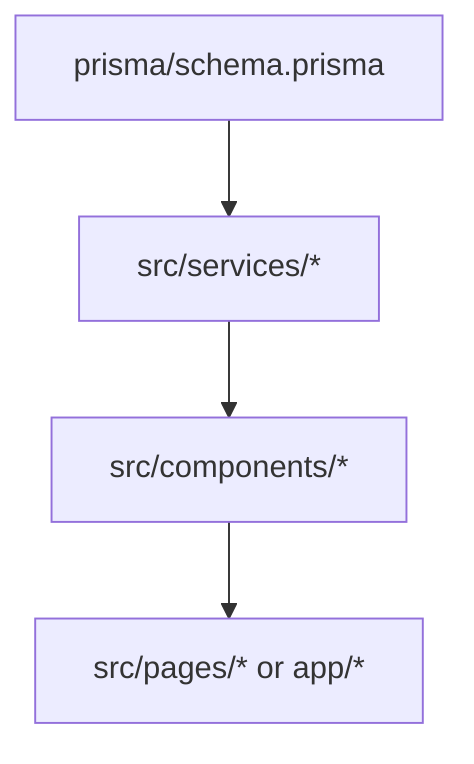
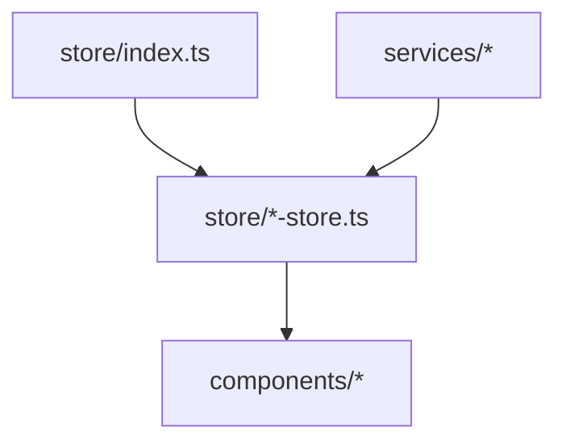
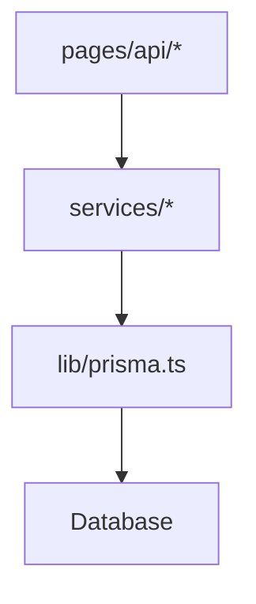
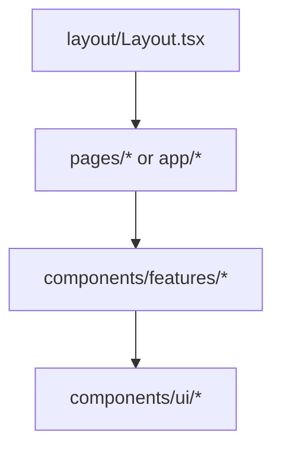
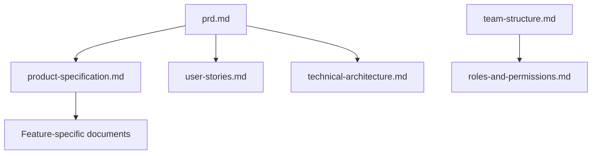

# ChMS - File Relationship Rules

This document defines the relationships between project files and establishes rules for maintaining integrity when files are updated. Following these rules will ensure consistency across documentation and code in the ChMS project.

## Directory Structure Overview

```
ChMS/
├── src/                  # Source code
│   ├── components/       # React components
│   ├── hooks/            # Custom React hooks
│   ├── pages/            # Next.js pages
│   ├── services/         # Service layer
│   ├── store/            # State management
│   ├── lib/              # Utility libraries
│   ├── types/            # TypeScript types
│   ├── utils/            # Utility functions
│   └── config/           # Configuration
├── app/                  # Next.js App Router
├── prisma/               # Database schema and migrations
├── docs/                 # Documentation
├── pm/                   # Project management
├── public/               # Static assets
└── tests/                # Test utilities and setup
```

## Core Documentation Relationships

### Database Documentation

| Primary File           | Related Files                   | Integrity Rule                                                                                               |
| ---------------------- | ------------------------------- | ------------------------------------------------------------------------------------------------------------ |
| `prisma/schema.prisma` | `pm/technical-architecture.md`  | When database schema is updated, ensure the database section in technical architecture is updated to match.  |
| `prisma/schema.prisma` | `docs/api-documentation.md`     | When database schema is updated, ensure API documentation reflects the changes to data models.               |
| `prisma/schema.prisma` | `src/types/*.ts`                | When database schema is updated, ensure TypeScript types reflect the changes.                                |
| `prisma/schema.prisma` | `src/services/*.service.ts`     | When database schema is updated, ensure service implementations are updated to handle the changes.           |
| `prisma/schema.prisma` | `docs/dev/testing-checklist.md` | When database schema is updated, ensure database testing sections are updated to cover new/changed features. |

### Authentication Documentation

| Primary File                        | Related Files               | Integrity Rule                                                                              |
| ----------------------------------- | --------------------------- | ------------------------------------------------------------------------------------------- |
| `src/services/auth/auth-options.ts` | `docs/api-documentation.md` | When authentication options are updated, ensure API documentation reflects the changes.     |
| `src/services/auth/auth.ts`         | `pm/security-policy.md`     | When authentication implementation is updated, ensure security policy is updated to match.  |
| `src/services/auth/auth.ts`         | `docs/user-guide.md`        | When user authentication flows change, ensure user guide is updated to reflect the changes. |

### Project Management Documentation

| Primary File                  | Related Files                  | Integrity Rule                                                                             |
| ----------------------------- | ------------------------------ | ------------------------------------------------------------------------------------------ |
| `pm/prd.md`                   | `pm/product-specification.md`  | When PRD is updated, ensure product specification reflects the changes.                    |
| `pm/prd.md`                   | `pm/user-stories.md`           | When PRD is updated, ensure user stories are updated to match.                             |
| `pm/product-specification.md` | `pm/technical-architecture.md` | When product specification is updated, ensure technical architecture reflects the changes. |
| `pm/team-structure.md`        | `pm/roles-and-permissions.md`  | When team structure is updated, ensure roles and permissions document is updated to match. |

## Code Relationships

### Database Models

| Primary File           | Related Files               | Integrity Rule                                                                                     |
| ---------------------- | --------------------------- | -------------------------------------------------------------------------------------------------- |
| `prisma/schema.prisma` | `src/types/*.ts`            | When database models are updated, ensure TypeScript types are updated to match.                    |
| `prisma/schema.prisma` | `prisma/migrations/`        | When database models are updated, ensure a new migration is created to update the database schema. |
| `prisma/schema.prisma` | `src/services/*.service.ts` | When database models are updated, ensure service classes are updated to handle the changes.        |
| `src/lib/prisma.ts`    | `src/services/*.service.ts` | When Prisma client configuration is updated, ensure services using the client are updated.         |

### Component Relationships

| Primary File                    | Related Files                                     | Integrity Rule                                                                                         |
| ------------------------------- | ------------------------------------------------- | ------------------------------------------------------------------------------------------------------ |
| `src/components/ui/*.tsx`       | `docs/tutorials/component-library-and-domains.md` | When UI components are updated, ensure component library documentation is updated.                     |
| `src/components/features/*.tsx` | `docs/guides/*.md`                                | When feature components are updated, ensure feature guides are updated to match.                       |
| `src/components/layout/*.tsx`   | `docs/user-guide.md`                              | When layout components are updated, ensure user guide reflects the changes to navigation or structure. |
| `src/components/*.tsx`          | `src/components/*.test.tsx`                       | When components are updated, ensure tests are updated to cover the changes.                            |

### State Management

| Primary File           | Related Files          | Integrity Rule                                                                  |
| ---------------------- | ---------------------- | ------------------------------------------------------------------------------- |
| `src/store/index.ts`   | `src/store/*-store.ts` | When store configuration is updated, ensure store slices are updated to match.  |
| `src/store/*-store.ts` | `src/components/*.tsx` | When store slices are updated, ensure components using the state are updated.   |
| `src/store/*-store.ts` | `src/hooks/use*.ts`    | When store slices are updated, ensure custom hooks using the state are updated. |

### API Routes

| Primary File         | Related Files               | Integrity Rule                                                                  |
| -------------------- | --------------------------- | ------------------------------------------------------------------------------- |
| `src/pages/api/*.ts` | `docs/api-documentation.md` | When API routes are updated, ensure API documentation is updated to match.      |
| `src/pages/api/*.ts` | `src/services/*.service.ts` | When API routes are updated, ensure services are updated to handle the changes. |
| `src/pages/api/*.ts` | `tests/api/*.test.ts`       | When API routes are updated, ensure API tests are updated to cover the changes. |

## Key File Relationships

### 1. Database Schema → Services → Components

The data flow typically follows this pattern:

1. **Database Schema** (`prisma/schema.prisma`): Defines the data models and relationships
2. **Services** (`src/services/`): Provides methods to interact with the database
3. **Components** (`src/components/`): Renders the UI based on data from services



### 2. Authentication Flow

The authentication system connects these files:

1. **Auth Options** (`src/services/auth/auth-options.ts`): Configures NextAuth.js
2. **Auth Service** (`src/services/auth/auth.ts`): Provides authentication utilities
3. **Auth API** (`src/pages/api/auth/[...nextauth].ts`): NextAuth.js API routes
4. **Auth Components** (`src/components/auth/*`): Login/registration forms
5. **Session Provider** (`src/components/providers/index.tsx`): Provides session context

```mermaid
graph TD
    A[auth-options.ts] --> B[auth.ts]
    A --> C[pages/api/auth/[...nextauth].ts]
    B --> D[components/auth/*]
    C --> E[components/providers/index.tsx]
    E --> F[app/layout.tsx or pages/_app.tsx]
```

### 3. State Management

The state management system connects:

1. **Store Definition** (`src/store/index.ts`): Defines the global state
2. **Store Slices** (`src/store/*-store.ts`): Specific state slices
3. **Components** (`src/components/*`): Consume state via hooks
4. **Services** (`src/services/*`): May update state after API calls



### 4. API Routes and Services

The API layer connects:

1. **API Routes** (`src/pages/api/*`): Define API endpoints
2. **Services** (`src/services/*`): Business logic and data access
3. **Prisma Client** (`src/lib/prisma.ts`): Database access



### 5. Component Hierarchy

The component hierarchy follows:

1. **Layout** (`src/components/layout/Layout.tsx`): Main layout wrapper
2. **Page Components** (`src/pages/*` or `app/*`): Page-specific components
3. **Feature Components** (`src/components/features/*`): Feature-specific components
4. **UI Components** (`src/components/ui/*`): Reusable UI components



## Documentation Relationships

### 1. Project Management Documents

The project management documents relate to each other:

1. **Product Requirements Document** (`pm/prd.md`): High-level requirements
2. **Product Specification** (`pm/product-specification.md`): Detailed specifications
3. **Technical Architecture** (`pm/technical-architecture.md`): System architecture
4. **User Stories** (`pm/user-stories.md`): User-centered requirements
5. **Team Structure** (`pm/team-structure.md`): Team organization



### 2. Application Documentation

The application documentation relates to:

1. **User Guide** (`docs/user-guide.md`): End-user instructions
2. **API Documentation** (`docs/api-documentation.md`): API reference
3. **Development Standards** (`docs/standards/*`): Coding standards
4. **Tutorials** (`docs/tutorials/*`): Developer guides

## Documentation Consistency Rules

1. **Version Numbers**: When updating version numbers, ensure they are updated in:

   - `README.md`
   - `package.json`
   - `CHANGELOG.md` (if exists)
   - Any version-specific documentation

2. **Feature Descriptions**: When adding/changing features, ensure they are consistently described in:

   - `README.md`
   - `pm/prd.md`
   - `pm/product-specification.md`
   - `docs/user-guide.md`
   - Relevant API documentation

3. **Database Schema Changes**: When making database schema changes:

   - Update `prisma/schema.prisma` first
   - Create database migration scripts using Prisma
   - Update TypeScript types in `src/types/`
   - Update service classes in `src/services/`
   - Update tests to cover the changes
   - Update API documentation if the changes affect API responses

4. **Testing Documentation**: When updating testing documentation:

   - Ensure test files are updated to implement the described tests
   - Update development tasks to reflect testing requirements
   - Ensure test coverage is maintained or improved

5. **Component Updates**: When updating UI components:
   - Update component documentation in tutorials
   - Update tests for the components
   - Update any guides that reference the components
   - Ensure accessibility standards are maintained

## File Naming Conventions

### 1. Components

- **Component Files**: PascalCase (`ComponentName.tsx`)
- **Component Directories**: PascalCase (`ComponentName/`)
- **Component Exports**: Named exports for components
- **Index Files**: Re-export components (`index.ts`)

### 2. Hooks

- **Hook Files**: camelCase with `use` prefix (`useHookName.ts`)
- **Hook Exports**: Named exports for hooks

### 3. Services

- **Service Files**: camelCase with `.service.ts` suffix (`name.service.ts`)
- **Service Directories**: camelCase (`serviceName/`)

### 4. Types

- **Type Files**: camelCase (`typeName.ts`)
- **Type Names**: PascalCase for interfaces and types
- **Enum Names**: PascalCase

### 5. API Routes

- **API Route Files**: camelCase (`routeName.ts`)
- **API Route Directories**: camelCase (`routeName/`)

### 6. Documentation Files

- **Documentation Files**: kebab-case (`file-name.md`)
- **Documentation Directories**: kebab-case (`directory-name/`)

## Import Rules

1. **Absolute Imports**: Use absolute imports with `@/` prefix

   ```typescript
   import { Component } from "@/components/Component";
   ```

2. **Import Order**:

   - External libraries first
   - Absolute imports second
   - Relative imports last
   - Separate groups with blank lines

3. **No Circular Dependencies**: Avoid circular dependencies between files

## File Modification Checklist

When modifying any file, ask yourself:

1. Does this change affect the database schema?
2. Does this change affect the API?
3. Does this change affect authentication or authorization?
4. Does this change affect the UI components?
5. Does this change affect state management?
6. Does this change require updates to tests?
7. Does this change require updates to documentation?

For each "yes" answer, identify the related files using this document and update them accordingly.

## File Modification Rules

1. **Component Modifications**:

   - Update component tests when modifying components
   - Update related types when changing component props
   - Update documentation when changing component behavior

2. **Schema Modifications**:

   - Create migrations when modifying the database schema
   - Update related services when changing models
   - Update types to match schema changes

3. **API Modifications**:
   - Update API documentation when modifying endpoints
   - Update related services when changing API behavior
   - Update tests to cover new functionality

## Documentation Update Rules

1. **Code Documentation**:

   - Document complex functions with JSDoc comments
   - Document component props with PropTypes or TypeScript
   - Document API endpoints with OpenAPI/Swagger

2. **Project Documentation**:
   - Update technical documentation when architecture changes
   - Update user documentation when features change
   - Update this file when file relationships change

## Automated Integrity Checks

Consider implementing the following automated checks:

1. **Pre-commit hooks**: Set up Git pre-commit hooks to check for consistency between related files.
2. **Documentation linting**: Use tools to ensure documentation is consistent and up-to-date.
3. **Schema validation**: Validate that database schema documentation matches actual database models.
4. **Test coverage**: Ensure test coverage is maintained when code is updated.

## Maintaining This Document

This document itself should be updated whenever:

1. New files or components are added to the project
2. Existing files are renamed or moved
3. New relationships between files are identified
4. New integrity rules are established

By following these rules, we can ensure that our project remains consistent and well-documented as it evolves.

## Version History

### 1.0.0 - [Current Date]

- Initial creation of file relationship rules document
